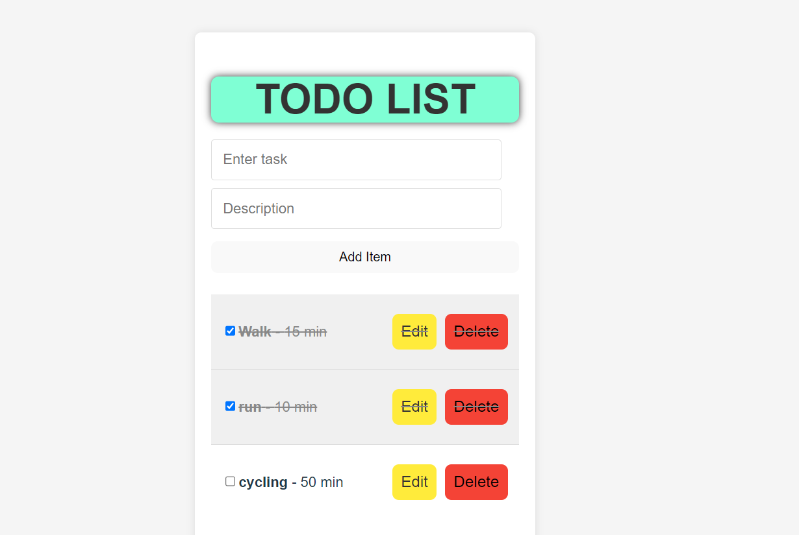

Todo List Application

This is a simple Todo List application built with React for the frontend and Node.js with Express and MongoDB for the backend. Users can add, edit, and delete tasks with descriptions.

Features:
Add new tasks with descriptions.
Edit existing tasks.
Delete tasks.
Responsive design for various screen sizes.
Technologies Used
Frontend: React
Backend: Node.js, Express, MongoDB
Styling: CSS

 
Clone the repository

bash
Copy code
git clone <repository_url>
cd todo-list-app
Install dependencies

bash
Copy code
# Install frontend dependencies
cd frontend
npm install

# Install backend dependencies
cd ../backend
npm install
Set up MongoDB

Install MongoDB on your local machine or use a cloud-based service.
Update the MongoDB connection URI in backend/server.js file.
Start the application

bash
Copy code
# Start the backend server (from the backend directory)
npm start

# Start the frontend development server (from the frontend directory)
npm start
Access the application

Open your web browser and go to http://localhost:3000 to view the Todo List application.

API Endpoints
POST /todos: Add a new task.
PUT /todos/
: Update an existing task.
DELETE /todos/
: Delete a task.
GET /todos: Retrieve all tasks.
screenshots

